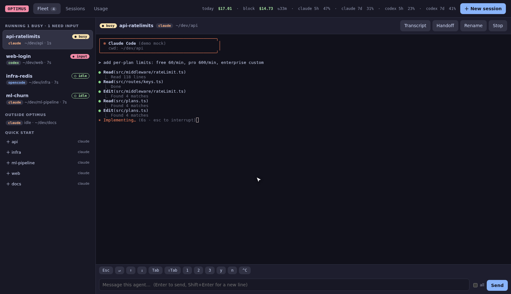

<div align="center">

# optimus

**The tmux of AI coding agents.**

Run Claude Code, Codex, opencode and other agents side by side, and drive them from your terminal, browser or phone.<br>
See what they cost, how much quota is left, and hand context from one session to another.

[](https://github.com/Unchained-Labs/optimus/actions/workflows/ci.yml)
[](https://github.com/Unchained-Labs/optimus/releases)
[](https://unchained-labs.github.io/optimus/)
[](LICENSE)

**[Documentation](https://unchained-labs.github.io/optimus/)** · [Install](#install) · [Quick start](#quick-start) · [Demo video](demo/optimus.mp4)


<sub>▶ <a href="demo/optimus.mp4"><b>Watch the full demo</b></a> (3 min: terminal, browser, phone) · recorded with mock agents on synthetic data</sub>

</div>

## What it does

- **One fleet:** start any agent in any project. Each runs in optimus's own tmux server, keeps going after you close the UI, and tells you, with a notification, when one needs you.
- **Terminal, browser, phone:** a keyboard-driven dashboard, plus a web dashboard with live interactive terminals that works on a phone. Remote control is on by default.
- **Every session, every agent:** a searchable history with transcripts, tokens and cost. Resume any session.
- **Parallel without collisions:** give each agent its own git worktree, or fan a task out to several agents and merge the best result.
- **Context that travels:** hand a session's goal, changed files and recent conversation to a new agent (Claude → Codex works) or to one that's already running.
- **Costs and quota:** daily and weekly spend, the current 5-hour block, real Claude and Codex 5h / 7d quota, and budgets.

<table>
<tr>
<td width="50%"><br><sub><b>Terminal:</b> the fleet with a live preview of each agent</sub></td>
<td width="50%"><br><sub><b>Browser:</b> the same fleet, with an interactive terminal</sub></td>
</tr>
</table>

## Install

```sh
curl -fsSL https://raw.githubusercontent.com/Unchained-Labs/optimus/main/install.sh | sh
```

Downloads the checksum-verified binary for Linux or macOS into `~/.local/bin` and runs a short setup wizard. Nothing is compiled, and no config file changes without your OK. Needs tmux for the multiplexer. → [Install options](https://unchained-labs.github.io/optimus/getting-started/install/)

## Quick start

```sh
optimus                 # terminal dashboard (1 Agents · 2 Sessions · 3 Projects · 4 Usage)
optimus claude          # start Claude Code here, inside optimus; Alt-q to come back
optimus web --open      # the same fleet in your browser
```

In the dashboard, `N` starts your default agent in the current project, `enter` attaches, `h` hands a session's context to another agent, and `?` shows every key. → [Quick start](https://unchained-labs.github.io/optimus/getting-started/quickstart/)

Works with **Claude Code**, **Codex** and **opencode** (history, cost, resume), plus Gemini CLI, cursor-agent, aider, amp, crush, goose and any shell. → [Agents](https://unchained-labs.github.io/optimus/reference/agents/)

## Learn more

| | |
|---|---|
| [Terminal dashboard](https://unchained-labs.github.io/optimus/guide/terminal/) | views, keys, the multiplexer |
| [Browser & phone](https://unchained-labs.github.io/optimus/guide/web/) | web dashboard, phone access, Remote Control |
| [Sessions & handoff](https://unchained-labs.github.io/optimus/guide/sessions/) | history, resume, moving context between agents |
| [Costs & quota](https://unchained-labs.github.io/optimus/guide/usage/) | spend, 5-hour blocks, real quota, budgets |
| [Configuration](https://unchained-labs.github.io/optimus/guide/configuration/) | every setting, environment variables, files |
| [CLI reference](https://unchained-labs.github.io/optimus/reference/cli/) · [Architecture](https://unchained-labs.github.io/optimus/reference/architecture/) · [FAQ](https://unchained-labs.github.io/optimus/faq/) | the deep end |

## Community

optimus is open source and contributions are welcome, from bug reports to new agent integrations.

- **Contribute:** read [CONTRIBUTING.md](CONTRIBUTING.md) for setup, a safe demo environment, and how to add an agent.
- **Report a bug or request a feature:** [open an issue](https://github.com/Unchained-Labs/optimus/issues/new/choose).
- **Ask questions or share how you use it:** [Discussions](https://github.com/Unchained-Labs/optimus/discussions).
- **Security issues:** report privately; see [SECURITY.md](SECURITY.md).
- **What's new:** [CHANGELOG.md](CHANGELOG.md) · [Releases](https://github.com/Unchained-Labs/optimus/releases).

Everyone taking part agrees to the [Code of Conduct](CODE_OF_CONDUCT.md).

## License

[MIT](LICENSE) © Erwin Lejeune
