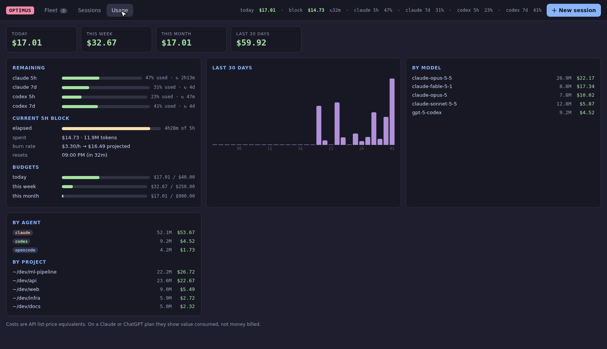
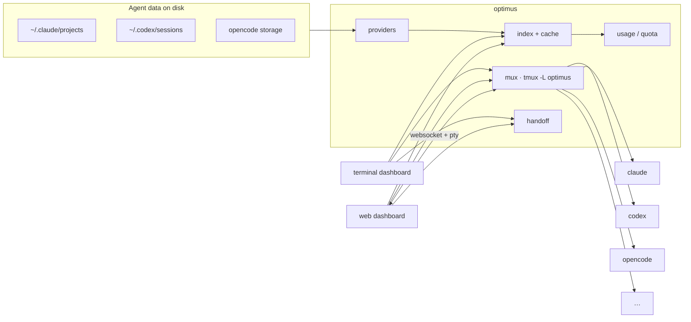

<div align="center">

# optimus

**The tmux of AI coding agents.**

Run a fleet of Claude Code, Codex, opencode and other agent sessions side by side.<br>
Drive them from your terminal, your browser or your phone; see what they cost and how much quota is left;<br>
and move context from one session to another, even between different agents.

[](https://github.com/Unchained-Labs/optimus/actions/workflows/ci.yml)
[](https://github.com/Unchained-Labs/optimus/releases)
[](go.mod)
[](LICENSE)

[Install](#install) · [Features](#features) · [Usage](#usage) · [Configuration](#configuration) · [Security](#security) · [Contributing](CONTRIBUTING.md)


<sub>▶ <a href="demo/optimus.mp4">Full demo video (MP4)</a> · recorded with mock agents on synthetic data</sub>

</div>

## Why optimus

Coding agents are good enough now that you run several at once: one refactoring the API, one fixing a flaky test, one exploring a migration. Each one ends up in its own terminal tab, with its own history format and its own idea of cost. You lose track of which agent is waiting for an answer, what the week has cost, and where the context from yesterday's session went.

optimus puts the fleet in one place:

- **One multiplexer** for every agent. Sessions keep running in a dedicated tmux server when you close the UI.
- **Two front ends on the same fleet.** A keyboard-driven terminal dashboard, and a web dashboard with live terminals that works on a phone.
- **Every past session, from every agent,** searchable, with turns, tokens and API-equivalent cost.
- **Context that travels.** Hand a session's goal, files, commands and recent conversation to a new agent of any kind, or to one that's already running.
- **Cost and quota you can see before you hit them:** daily and weekly spend, the current 5-hour block, real 5h / 7d plan quota, and budgets.

## Features

| | |
|---|---|
| **Fleet** | Start any agent in any project and see all of them at once, each marked busy, needs input or idle. Attach with `enter`, come back with `Alt-q`, cycle with `Alt-←/→`. Send a prompt to one agent or broadcast it to all of them. |
| **Browser & phone** | `optimus web` serves the same fleet with interactive xterm.js terminals, a message box, and one-tap keys (Esc, ↵, 1/2/3, y/n, ^C) for answering prompts from your phone. Token auth, localhost by default. |
| **Remote control by default** | Starting a session also brings up the web dashboard, and Claude sessions launch with Claude Code's `--remote-control`, so they appear in the Claude apps too. |
| **One step to a new session** | `optimus claude` or `optimus codex ~/dev/web -p "…"` from a shell. `N` in the dashboard starts your default agent in the project you're looking at. In the browser, **＋ New session** gives you agent, project, first message and Remote Control in one dialog. |
| **Sessions** | Unified history for Claude Code (including sub-agents), Codex and opencode: titles, models, turns, tokens, cost. Read transcripts, resume any session into the fleet. |
| **Handoff** | Build a context document from any session (original request, files changed and read, recent commands, the latest conversation within a token budget) and start a new agent with it, send it into a running one, copy it, or save it. It can optionally be condensed by an agent first. |
| **Usage & quota** | Spend for today, this week, this month and all time; a daily chart; breakdowns by model, agent and project. The current 5-hour block shows burn rate and a projection. Real Claude and Codex 5h / 7d quota, plus your own budgets. |
| **Projects** | Sessions grouped by folder, with the agents used and 7-day and total spend. Start an agent in any of them. |
| **Scriptable** | Everything is a CLI command, and most support `--json`. |

<table>
<tr>
<td width="50%"><br><sub><b>Terminal</b> · the fleet with a live preview of each agent</sub></td>
<td width="50%"><br><sub><b>Browser</b> · the same fleet with an interactive terminal</sub></td>
</tr>
<tr>
<td><br><sub>Start any agent in any project, with a first message</sub></td>
<td><br><sub>Hand a session's context to a new or running agent</sub></td>
</tr>
<tr>
<td><br><sub>Spend, the 5-hour block, quota and budgets</sub></td>
<td><br><sub>The same numbers in the browser</sub></td>
</tr>
</table>

<p align="center">&nbsp;&nbsp;</p>

## Install

```sh
curl -fsSL https://raw.githubusercontent.com/Unchained-Labs/optimus/main/install.sh | sh
```

The wizard:
- checks for tmux
- installs a checksum-verified release binary, or builds from source if there's no release for your platform
- adds it to your `PATH`
- detects your agents and asks for your default one
- offers to connect the Claude Code status line so optimus sees your real quota
- asks for optional budgets

Nothing in your config files changes unless you say yes.

<details>
<summary>Other ways to install</summary>

```sh
# unattended
curl -fsSL https://raw.githubusercontent.com/Unchained-Labs/optimus/main/install.sh | sh -s -- --yes [--statusline] [--bin-dir DIR] [--version v0.1.0]

# from source
git clone https://github.com/Unchained-Labs/optimus && cd optimus && make install   # → ~/.local/bin/optimus
```

Requirements: Linux or macOS, and **tmux** for the multiplexer (sessions and usage work without it). **Go 1.25+** is needed only when building from source.
</details>

## Usage

### Quick start

```sh
optimus                 # terminal dashboard
optimus claude          # start Claude Code here, inside optimus (Alt-q to return)
optimus web --open      # the same fleet in your browser
```

### Terminal dashboard

| Key | Action |
|---|---|
| `1`–`4`, `tab` | Agents · Sessions · Projects · Usage |
| `n` / `N` | start an agent (pick which and where) / start your default agent in this project right away |
| `enter` | attach to the agent (`Alt-q` comes back, `Alt-←/→` switches agents) |
| `s` / `b` / `space` | send a prompt / broadcast to all (or marked) agents / mark |
| `h` / `H` / `y` | hand off context / condensed handoff / copy handoff to the clipboard |
| `r` | resume a session (Sessions) · rename (Agents) |
| `o` / `/` / `a` / `p` | transcript / filter / filter by agent / filter by project |
| `x` | stop an agent |
| `w` | open the web dashboard |
| `?` / `q` | help / quit (agents keep running) |

### Browser & phone

```sh
optimus web --open                 # foreground; --bg keeps it running in the background
optimus web --url                  # print the login link (contains the access token)
optimus web --addr 100.x.y.z:7777  # listen on a private interface (e.g. Tailscale) for your phone
```

The dashboard listens on `127.0.0.1:7777`. Opening the link from `optimus web --url` logs that browser in. Each browser terminal is its own view of the agent, so watching from your phone doesn't move your terminal. Closing the tab never stops the agent.

### Sessions and handoff

```sh
optimus ls -p api                              # sessions of a project (also --json, -a agent, --live)
optimus show last --tail 20                    # read a transcript
optimus resume 3f2a --attach                   # reopen a session inside optimus
optimus handoff 3f2a --to codex                # continue a Claude session in Codex
optimus handoff 3f2a --into 2                  # feed it to a running agent
optimus handoff 3f2a --copy --note "focus on the auth bug"
```

### Costs and quota

```sh
optimus usage --by model --since 30d    # also: day, month, agent, project, session · --json
optimus blocks                          # 5-hour usage blocks
optimus limits                          # quota windows + budgets
```

Claude Code only shares plan quota (5h and 7d windows) with its status line. `optimus config statusline --install` makes optimus that status line. It backs up `settings.json` and keeps any existing status line working by chaining it. Codex quota is read from its session logs and needs no setup.

> [!NOTE]
> Costs are API list-price equivalents, including cache reads and writes and sub-agents. On a Claude or ChatGPT plan they show the **value** you consumed, not what you were billed.

### Multiplexer from the shell

```sh
optimus ps                                      # running agents and their state
optimus send all "run the tests and report"     # broadcast (use - to read stdin)
optimus peek 2 -n 30                            # look at an agent's screen
optimus attach 2 · optimus kill 2
```

Run `optimus help` for the full list.

## Supported agents

| Agent | Run in optimus | History, cost, transcripts | Resume | Remote control |
|---|:-:|:-:|:-:|:-:|
| [Claude Code](https://docs.anthropic.com/en/docs/claude-code) | ✓ | ✓ incl. sub-agents | ✓ | web + Claude apps |
| [Codex CLI](https://github.com/openai/codex) | ✓ | ✓ incl. quota | ✓ | web |
| [opencode](https://github.com/sst/opencode) | ✓ | ✓ | ✓ | web |
| Gemini CLI, cursor-agent | ✓ | receives handoffs | ✓ | web |
| aider, amp, crush, goose, any shell | ✓ | receives handoffs | – | web |

`optimus agents` shows what's detected and where its data lives. Adding an agent usually takes one file; see [CONTRIBUTING.md](CONTRIBUTING.md#adding-an-agent).

## Configuration

`~/.config/optimus/config.json`. Edit it with `optimus config edit`, or set one key at a time with `optimus config set KEY VALUE`.

```json
{
  "default_agent": "claude",
  "remote": { "claude_remote_control": true, "web_autostart": true, "addr": "127.0.0.1:7777" },
  "budgets": { "daily_usd": 50, "weekly_usd": 250, "monthly_usd": 800, "block_usd": 30 },
  "block_hours": 5,
  "handoff_max_tokens": 20000,
  "summarize_with": "claude",
  "agents": {
    "claude": { "args": ["--model", "opus"] },
    "codex":  { "command": "/opt/codex/bin/codex" }
  },
  "pricing": { "my-local-model": { "input": 0, "output": 0 } }
}
```

| Key | Default | Meaning |
|---|---|---|
| `default_agent` | `claude` | agent used by `optimus new`, `N` and quick start |
| `remote.claude_remote_control` | `true` | start Claude sessions with `--remote-control` |
| `remote.web_autostart` | `true` | bring up the web dashboard when a session starts |
| `remote.addr` | `127.0.0.1:7777` | where the web dashboard listens |
| `budgets.*_usd` | – | daily, weekly, monthly and per-block spend alerts |
| `agents.<name>` | – | override an agent's binary, or add default arguments |
| `pricing` | built in | per-million-token prices keyed by model-id prefix |
| `handoff_max_tokens` | `20000` | size budget for handoff documents |
| `statusline_chain` | – | your previous status line, kept working behind optimus |

## Security

- **Local by default.** The web dashboard listens on `127.0.0.1`, and every request needs the access token (`~/.local/state/optimus/web-token`, mode 0600). Requests from other websites are refused.
- **Phone access:** use a private network such as Tailscale or WireGuard. Anyone with the token can type into your agents, so never expose the port to the internet.
- **Agent histories stay on your machine.** optimus reads them locally and never sends them anywhere.
- **No silent config edits.** Changes to your config files happen only when you confirm them, and are backed up first.

See [SECURITY.md](SECURITY.md) for the full model and how to report a vulnerability.

## How it works



- **Providers** parse each agent's transcripts into sessions with hourly, per-model token buckets. Results are cached in `~/.cache/optimus/index.gob`, keyed by file size and modification time, so only changed sessions are re-read.
- **The multiplexer** is a dedicated tmux server with generated config. Windows carry the agent, folder and session id, so optimus always knows which transcript belongs to which window. The state badge is a heuristic based on the bottom of each pane.
- **Browser terminals** each get a private tmux session grouped with the agents' session, attached through a pty and bridged to xterm.js over a websocket. The view is removed when the tab closes.
- **Handoffs** are written to `~/.local/state/optimus/handoffs/`. The receiving agent gets a short prompt telling it to read the file, which works with every agent and avoids argument-length and paste-size limits.

## FAQ

<details>
<summary><b>Does optimus replace tmux or my terminal?</b></summary>
No. It runs its own tmux server (<code>tmux -L optimus</code>) next to yours and works inside an existing tmux session too.
</details>

<details>
<summary><b>Does it send my code or transcripts anywhere?</b></summary>
No. It only reads local files. The only network traffic is the web dashboard you start yourself and, with <code>--summarize</code>, the agent you choose to condense a handoff.
</details>

<details>
<summary><b>Why do costs differ from my bill?</b></summary>
On a subscription plan you aren't billed per token. optimus shows what the same traffic would cost at API list prices, which is a useful measure of how much you're getting from a plan. Override prices in <code>pricing</code>.
</details>

<details>
<summary><b>Can I use it with agents started outside optimus?</b></summary>
Yes. Their history, costs and transcripts show up like any other, running Claude sessions are listed as "outside optimus", and you can hand their context to an agent inside optimus. Only agents started inside optimus can be attached and driven.
</details>

## Contributing

Issues and pull requests are welcome. [CONTRIBUTING.md](CONTRIBUTING.md) covers development setup, the safe demo environment, and how to add an agent. Please follow the [Code of Conduct](CODE_OF_CONDUCT.md).

## Acknowledgements

Built on [tmux](https://github.com/tmux/tmux), [Bubble Tea](https://github.com/charmbracelet/bubbletea) and [Lip Gloss](https://github.com/charmbracelet/lipgloss), [xterm.js](https://xtermjs.org), [coder/websocket](https://github.com/coder/websocket) and [creack/pty](https://github.com/creack/pty). Demo recorded with [VHS](https://github.com/charmbracelet/vhs).

## License

[MIT](LICENSE) © Erwin Lejeune
