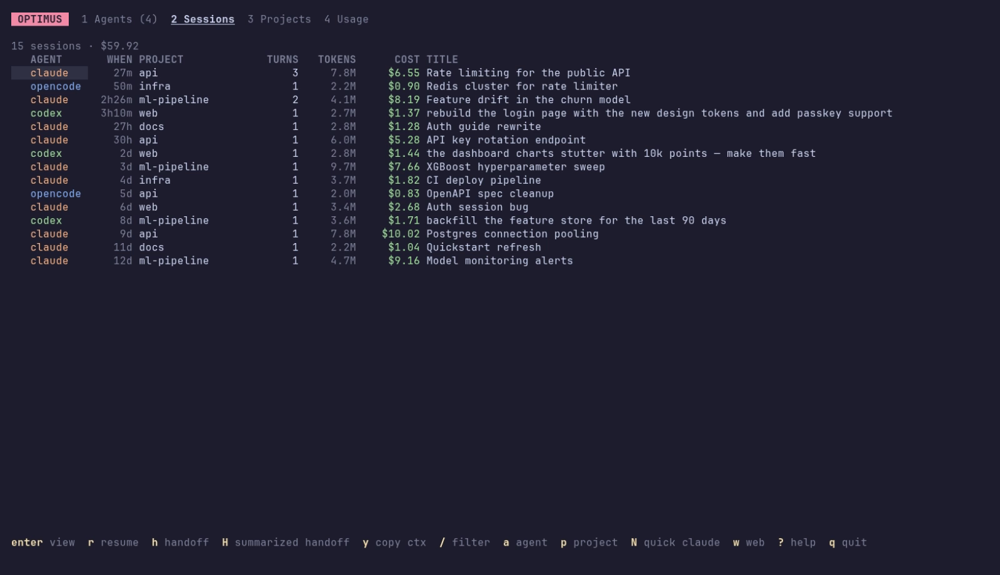
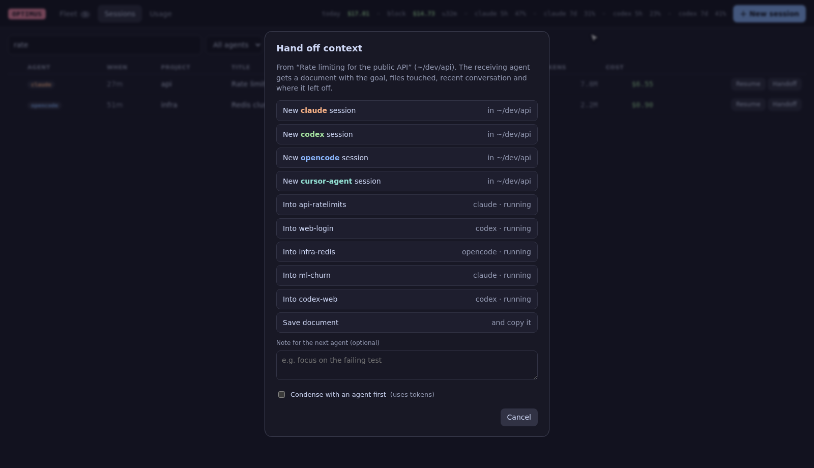

# Sessions & handoff

## Every session, every agent

```sh
optimus ls                      # newest first
optimus ls -p api -a codex      # filter by project and agent
optimus ls --live --json        # only running sessions, as JSON
optimus show last --tail 20     # a transcript
```



### Automated sessions

Sessions started by scripts and schedulers (`claude -p`, Agent SDK runs, `codex exec`, cron jobs) are marked automated and **hidden from session lists by default**. They still count in costs and usage.

| Where | Show them |
|---|---|
| shell | `optimus ls --all` |
| terminal dashboard | ++z++ in Sessions (shown with ⚙) |
| browser | the **automated** checkbox |

### Search inside transcripts

Find the session where something was discussed, by what was said rather than its title:

```sh
optimus search "connection pool"     # newest first, with the matching passage
optimus search kafka -n 5 --json
```

In the terminal dashboard press ++shift+s++ in Sessions; in the browser tick **inside transcripts** next to the search box. Matching passages replace the titles; ++esc++ clears the search.

optimus reads each agent's own history:

| Agent | Source | Notes |
|---|---|---|
| Claude Code | `~/.claude/projects/*/*.jsonl` | sub-agent transcripts counted toward their parent session; AI titles; live sessions from `~/.claude/sessions` |
| Codex CLI | `~/.codex/sessions/**/rollout-*.jsonl` | token deltas from cumulative counts; plan quota from rate-limit events |
| opencode | `~/.local/share/opencode/storage` | per-message tokens and cost |

Parsed sessions are cached in `~/.cache/optimus/index.gob`, keyed by file size and modification time, so a large history (multi-GB) is only fully read once. `optimus reindex` rebuilds the cache.

## Resume

++r++ in Sessions, **Resume** on the web, or:

```sh
optimus resume 3f2a --attach
```

This reopens the session inside the fleet (`claude --resume`, `codex resume`, `opencode --session`, …). If it's already open, you're taken to its window.

## Handoff

A **handoff** turns a session into a context document another agent can pick up from:

```markdown
# Handoff: Rate limiting for the public API
| Session | `13e1…` (claude) | Project | `~/dev/api` | Branch | `main` | …
## Original request
## Files changed            ← from edit tool calls, newest first
## Files consulted
## Recent commands
## Conversation (most recent)   ← newest messages that fit the token budget
## Where it left off            ← the latest request, and a reminder to verify state
```

Send it wherever you need:

=== "Dashboard"

    ++h++ on a session or agent opens the target picker: **new &lt;agent&gt; session**, **into** a running agent, **copy to clipboard**, or **save to file**. ++shift+h++ condenses the document with an agent first.

=== "Browser"

    **Handoff** on a session row, in a transcript, or on the selected agent. Add a note for the next agent, and optionally condense it.

=== "CLI"

    ```sh
    optimus handoff 3f2a --to codex                    # start Codex with it
    optimus handoff 3f2a --into 2                      # paste into a running agent
    optimus handoff 3f2a --copy --note "focus on the flaky test"
    optimus handoff 3f2a --print > context.md
    optimus handoff last --to claude --summarize       # condensed by an agent first
    ```



### Review before sending

Check (and edit) exactly what the next agent will read:

- **Terminal dashboard:** pick **✎ preview & edit first** in the target picker. The document opens in `$EDITOR`; save, close, then choose where to send it.
- **Browser:** open **✎ Preview & edit the document** in the Handoff dialog, edit, then click a target.
- **Shell:** `optimus handoff 3f2a --to codex --edit`.

### When quota runs low

When an agent's plan quota window reaches `handoff_suggest_pct` (default 85%), optimus suggests continuing its running sessions in another agent, Claude ↔ Codex by default:

- a notification once per session and quota window,
- a banner in both dashboards: ++shift+c++ in the terminal dashboard, **Continue in codex** in the browser.

```sh
optimus config set handoff_suggest_pct 90     # -1 turns suggestions off
```

Change the target per agent with `"handoff_suggest_to": {"claude": "opencode"}` in the config. Claude quota needs the status line hooked up (`optimus config statusline --install`); Codex reports it on its own.

The document is saved in `~/.local/state/optimus/handoffs/`. The receiving agent gets a one-line prompt pointing to it ("Read the handoff document at … then continue"), which works the same for every agent and never hits argument or paste-size limits.

!!! note "Token budget"
    `handoff_max_tokens` (default 20 000) caps the document size. Long messages are cut with a marker, and the oldest conversation goes first. `--summarize` asks `summarize_with` (default `claude`) for a structured brief instead, which uses tokens.
