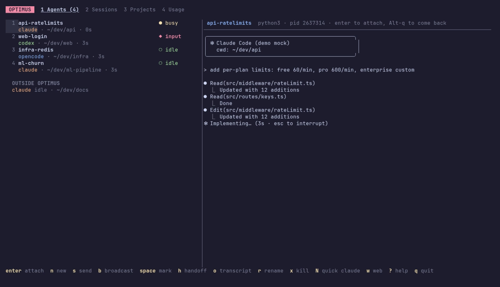

# Terminal dashboard

```sh
optimus
```



The dashboard has four views. Switch with ++1++–++4++ or ++tab++.

| View | What it shows |
|---|---|
| **Agents** | agents running in optimus, their state, and a live preview of the selected one; Claude sessions running elsewhere are listed under *Outside optimus* |
| **Sessions** | every past session of every agent, newest first, with turns, tokens and cost |
| **Projects** | sessions grouped by folder, agents used, 7-day and total spend |
| **Usage** | spend cards, quota windows, the current 5-hour block, budgets, a 14-day chart, top models and agents |

## The multiplexer

Agents run inside a private tmux server (`tmux -L optimus`), separate from your own tmux, so:

- they keep running when you quit the dashboard, close the terminal or lose SSH;
- ++enter++ attaches you to an agent's real terminal, ++alt+q++ brings you back, and ++alt+left++ / ++alt+right++ switches agents while attached;
- the browser dashboard and the CLI see the same agents.

### Agent state

| Badge | Meaning |
|---|---|
| `● busy` | working (e.g. "esc to interrupt" is on screen) |
| `◆ input` | waiting for you: a permission prompt, `(y/n)`, "Allow command?" |
| `○ idle` | finished, ready for the next message |
| `✗ exit` | the agent process ended |

Claude Code and Codex sessions started by optimus report their state themselves through hooks, so *needs input* is exact and comes with the question ("wants to use Write: hello.txt"). Other agents' states come from the bottom of their screen. See [Attention & notifications](notifications.md).

Press ++i++ (or ++alt+n++ while attached) to jump to the next agent waiting for you.

## Command palette

++ctrl+k++ (or ++colon++) opens one searchable list of everything: running agents (*go to …*), recent sessions, *new &lt;agent&gt; in &lt;project&gt;* for your recent projects, and every action. Type a few words in any order (`codex api`, `rate lim`) and press ++enter++. The browser has the same palette on ++ctrl+k++ (++cmd+k++ on macOS), even while a terminal has focus.

## Keys

| Key | Agents | Sessions | Projects |
|---|---|---|---|
| ++enter++ | attach | read transcript | sessions of this project |
| ++i++ | select the next agent waiting for you | ← | ← |
| ++exclamation++ | answer its question without attaching | | |
| ++shift+f++ | fan out a task to several agents in worktrees | ← | ← |
| ++shift+d++ / ++shift+m++ / ++shift+x++ | worktree agent: diff / merge / discard | | |
| ++n++ | start an agent: pick which and where | ← | ← |
| ++shift+n++ | start the default agent here | in the session's folder | in this project |
| ++s++ | send a prompt | | |
| ++space++ / ++b++ | mark / broadcast | | |
| ++h++ / ++shift+h++ | hand off this agent's context | hand off / condensed | |
| ++y++ | | copy handoff to the clipboard | |
| ++r++ | rename | resume into the fleet | |
| ++o++ | open transcript | open transcript | |
| ++x++ | stop | | |
| ++slash++ / ++a++ / ++p++ | | filter text / agent / project | |
| ++c++ | | | start an agent here |
| ++w++ | open the web dashboard | ← | ← |
| ++question++ / ++q++ | help / quit | ← | ← |

## From the shell

Every action has a command, handy in scripts and other tmux panes:

```sh
optimus ps                                   # agents and their state
optimus peek 2 -n 30                         # the bottom of an agent's screen
optimus send 2 "add a test for that"         # message one agent
optimus send all "commit your work" --no-enter
optimus attach 2                             # Alt-q to detach
optimus kill 2
```
