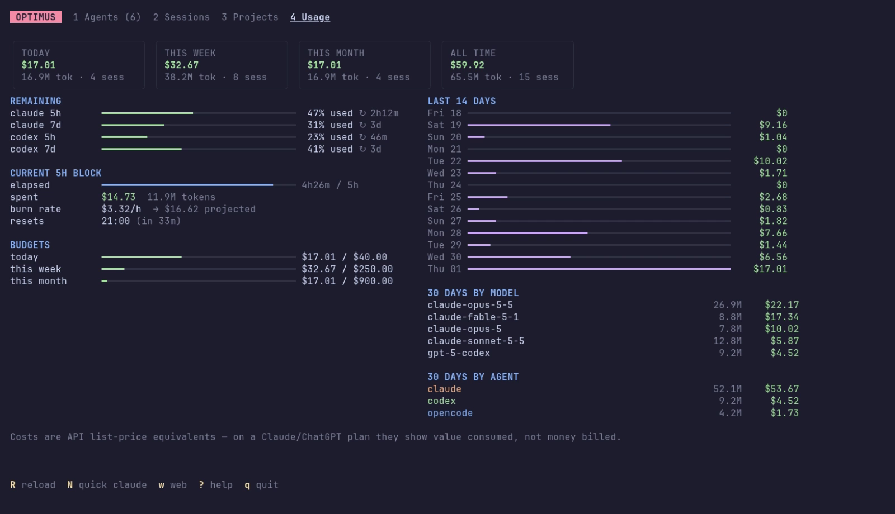

# Costs & quota



## Spend

```sh
optimus usage                         # by day, last 30 days
optimus usage --by model --since 7d   # day | month | model | agent | project | session
optimus usage --since 2026-09-01 --json
```

Every assistant response's tokens are bucketed per hour and per model, including cache reads, 5-minute and 1-hour cache writes, and sub-agents. They're priced at API list rates.

!!! info "What the dollars mean"
    On a Claude Max or ChatGPT plan you're not billed per token. optimus shows what the same traffic would cost on the API, which is a good measure of how much you use the plan. opencode's own cost is used for models optimus has no price for. Add or override prices under `pricing` in the config.

## 5-hour blocks

Claude plans meter usage in 5-hour windows that start with your first message. `optimus blocks` lists them; the dashboard shows the current one with elapsed time, spend, **burn rate** and a **projection** to the end of the window.

```sh
optimus blocks -n 5
```

## Real quota

| Agent | How optimus gets it |
|---|---|
| Claude | Claude Code only gives 5h / 7d usage percentages to its **status line** command. `optimus config statusline --install` makes optimus the status line and records each snapshot; an existing status line keeps working (chained). |
| Codex | read from the rate-limit events in Codex's own session logs; no setup needed |

```sh
optimus limits
```

Near the limit, optimus suggests continuing running sessions in another agent. See [Sessions & handoff → When quota runs low](sessions.md#when-quota-runs-low).

As a bonus, the status line becomes a compact summary:

```text
◆ Opus 5.5 · api · session $4.50 · 5h ███░░ 62% ↻1h23m · 7d █░░░░ 18%
```

## Budgets

```sh
optimus config set budgets.daily_usd 40
optimus config set budgets.weekly_usd 250
optimus config set budgets.monthly_usd 900
optimus config set budgets.block_usd 30
```

Budgets appear as bars in both dashboards and in `optimus limits`, turning yellow at 60% and red at 90%.
