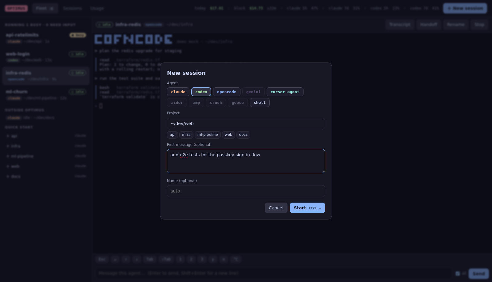
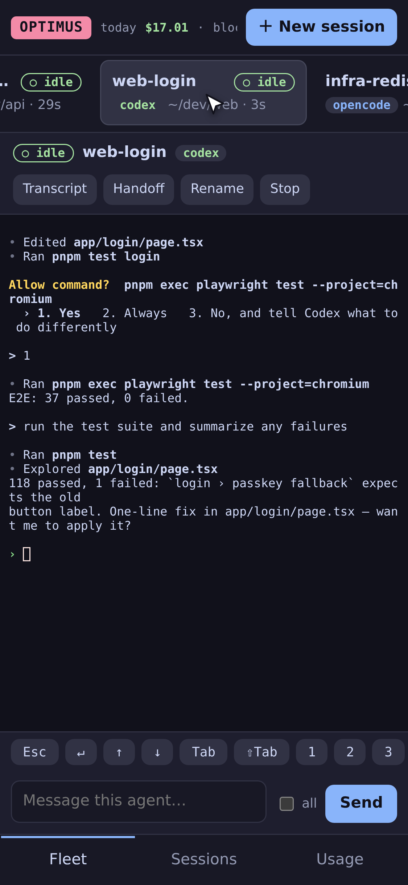

# Browser & phone

```sh
optimus web --open
```


The web dashboard drives the same agents as the terminal UI:

- **Fleet:** every running agent with its state, plus a **live, interactive terminal** for the one you select. Type straight into it, or use the message box (++enter++ sends, ++shift+enter++ adds a new line; tick **all** to broadcast).
- **Keys:** one-tap buttons for Esc, ↵, arrows, Tab, 1/2/3, y/n and ^C, for answering an agent's questions without a keyboard.
- **Sessions:** search, filter by agent or project, read transcripts, **Resume** and **Handoff**.
- **Usage:** spend, quota, the current block, budgets, a 30-day chart, and breakdowns by model, agent and project.
- **Command palette** (++ctrl+k++ or **⌘K**): jump to any agent, session or project, or run any action.
- **＋ New session** (or ++n++): agent, project, first message, name, and Claude Remote Control. **Quick start** in the sidebar starts your default agent in a recent project with one click.

<div class="op-row" markdown>


</div>

## On your phone

<div class="op-row" markdown>
<div class="op-phone" markdown></div>
<div class="op-phone" markdown></div>
</div>

The layout adapts to small screens: agents become a swipeable row, the terminal fills the screen, and navigation moves to the bottom.

To reach it from your phone, put both devices on a private network and listen on that interface:

```sh
optimus web --bg --addr 100.101.102.103:7777   # your machine's Tailscale IP
optimus web --url --addr 100.101.102.103:7777   # prints a QR code: scan it with the phone's camera
```

`optimus web --url` prints a QR code of the login link (Tailscale addresses first). The **📱** button in the dashboard shows the same QR, which is handy when it's already open on your laptop.

### Install it as an app

The dashboard is a Progressive Web App: **Add to Home Screen** (iOS Safari) or **Install app** (Android Chrome) gives it an icon and a full-screen window. Installing, and system notifications on the phone, need HTTPS. The simplest way is Tailscale's built-in HTTPS proxy:

```sh
optimus web --bg                     # 127.0.0.1:7777
tailscale serve --bg 7777            # https://<machine>.<tailnet>.ts.net
```

Then open `https://<machine>.<tailnet>.ts.net/?token=…` (the token from `optimus web --url`) on the phone.

### Push notifications

For notifications on the phone even when the app is closed, use [ntfy](https://ntfy.sh): install the ntfy app, subscribe to a long random topic, then

```sh
optimus config set notifications.ntfy https://ntfy.sh/<your-long-random-topic>
```

See [Attention & notifications](notifications.md).

!!! danger "Don't expose it to the internet"
    Anyone with the access token can type into your agents. Use Tailscale, WireGuard or an SSH tunnel. `--addr 0.0.0.0:7777` works on a trusted LAN and prints a warning. There is no built-in TLS.

## Always on

By default, starting or resuming a session also starts the dashboard in the background (`remote.web_autostart`), so remote control is ready whenever an agent is running. Manage it with:

```sh
optimus web --bg       # start in the background now
optimus web --url      # print the login link
optimus web --stop     # stop the background dashboard
```

## Claude Remote Control

Claude sessions started or resumed by optimus also get Claude Code's own `--remote-control=<name>`, so they appear in the Claude desktop, web and mobile apps. Turn it off globally with `optimus config set remote.claude_remote_control false`, or per session in the **New session** dialog.

## If a terminal looks stuck

The dot next to the agent's name shows the terminal link: green is live, yellow is connecting, red means lost. Click it to reconnect. The page also reconnects on its own when the link goes quiet for 40 seconds, when the tab comes back to the foreground, or when the network returns.

## How the terminals work

Each browser terminal is a private tmux session *grouped* with the agents' session: it shares the windows but has its own current window and size. It's attached through a pty and streamed to [xterm.js](https://xtermjs.org) over a websocket. Watching an agent from your phone doesn't move the window you're looking at on your laptop, and closing the tab removes the view, never the agent.
