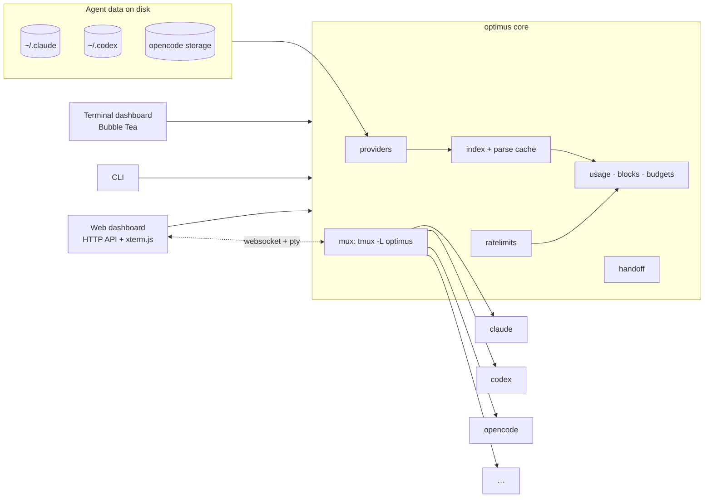

# Architecture

| Package | Responsibility |
|---|---|
| `internal/providers` | one adapter per agent: discover sessions, parse transcripts into normalized sessions and hourly per-model token buckets, build launch and resume arguments |
| `internal/index` | runs providers in parallel and caches results (`gob`, keyed by size and modification time); matches windows to sessions |
| `internal/pricing` | model price table with longest-prefix matching and config overrides |
| `internal/usage` | grouping by day, model, agent and project; 5-hour blocks; budgets; projects |
| `internal/ratelimits` | Claude quota snapshots from the status line, Codex quota from rollouts |
| `internal/mux` | the tmux backend: spawn, list, capture, send, keys, private browser views, state detection |
| `internal/handoff` | context documents within a token budget, optional condensing by an agent |
| `internal/tui` | the terminal dashboard |
| `internal/web` | the browser dashboard: JSON API, token auth, websocket terminals, embedded static UI |
| `internal/cli` | subcommands, installer helpers, status line |

## Design notes

- **Read-only on agent data.** optimus never writes to an agent's history. It only reads files, and it launches agents through their own CLIs.
- **Hour buckets, not raw events.** Sessions store per-hour, per-model usage, enough for daily charts, 5-hour blocks and budgets, and small enough to cache thousands of sessions.
- **Dedup at the source.** Claude Code writes one line per content block of a response, and Codex reports cumulative counters. Providers dedupe by message id or take deltas, so nothing is counted twice.
- **tmux as the process supervisor.** Agents outlive every UI. Optimus windows carry `@optimus_agent`, `@optimus_cwd` and `@optimus_session` options; background services (the web dashboard) run in a separate `optimus-svc` session that is never listed as an agent.
- **Browser views are grouped sessions.** Each terminal tab gets its own current window and size, and is removed when the websocket closes. Leftovers from a crash are swept on startup.
- **Handoffs by reference.** Agents receive a short prompt pointing to the document on disk, so the same mechanism works for every agent.

## Built with

[tmux](https://github.com/tmux/tmux), [Bubble Tea](https://github.com/charmbracelet/bubbletea) and [Lip Gloss](https://github.com/charmbracelet/lipgloss), [xterm.js](https://xtermjs.org), [coder/websocket](https://github.com/coder/websocket) and [creack/pty](https://github.com/creack/pty). The demo is recorded with [VHS](https://github.com/charmbracelet/vhs), and this site is built with [Material for MkDocs](https://squidfunk.github.io/mkdocs-material/).
